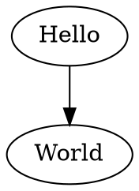

# Strings Solutions

## 1. Balanced Delimiters

\label{solution.strings.1}

### Approach

We know that `"([)]"` isn't balanced, whereas `"([])"` is balanced. This is
because the order in which delimiters are closed matters, just like for example
HTML tags. Hence using an integer counter for each delimiter, incrementing when
you see an open and decrementing when you see a close, can't work. Instead we
have to know what open delimiters we've seen, and that we're closing them in the
correct (reverse) order. Already we know that if we need to keep track of what
open delimiters we've seen the best case space complexity is O(n), and we need a
data structure to help us.

If you imagine you have just seen the first two characters of the above example,
if we see a closing delimiter what must it be? It must be the most recently
opened delimiter. What kind of data structure can help you progress through a
sequence and give you access to the most recent element? A stack. Specifically:

-   When you see an open delimiter, push it onto the stack.
-   When you see a close delimiter, pop the stack (returning the most recent
    open delimiter) and check the actual close delimiter is what is expected.

This gives a worst-case time complexity of O(n) and a worst-case space
complexity of O(n).

### Java

~~~~ {.java .numberLines}
import java.util.*;
import java.io.*;

public class Solution {
    private static final Map<Character, Character> pairs = new HashMap<>();
    static {
        pairs.put('{', '}');
        pairs.put('(', ')');
        pairs.put('[', ']');
    }
    public static boolean are_delimiters_balanced(final String input) {
        final Deque<Character> stack = new ArrayDeque<>();
        for (int i = 0; i < input.length(); i++) {
            final Character c = input.charAt(i);
            if (pairs.containsKey(c)) {
                stack.push(c);
            } else if (stack.size() == 0 || !pairs.get(stack.pop()).equals(c)) {
                return false;
            }
        }
        return stack.size() == 0;
    }
}
~~~~~~~~~~~~~~~~~~~~~~~~~~~~~~~~~~~~~~~~~~~~~~~~~

### Python

~~~~ {.python .numberLines}
import collections

def are_delimiters_balanced(input):
    stack = collections.deque()
    pairs = {
        '(': ')',
        '{': '}',
        '[': ']',
    }
    for c in input:
        if c in pairs:
            stack.appendleft(c)
        elif len(stack) == 0 or c != pairs[stack.popleft()]:
            return False
    return len(stack) == 0
~~~~~~~~~~~~~~~~~~~~~~~~~~~~~~~~~~~~~~~~~~~~~~~~~

## 2. Permutations of Characters

\label{solution.strings.2}

### Approach

Compare examples of permutations from less to more complex:

-   `""` is `[""]`.
-   `"a"` is `["a"]`.
-   `"ab"` is `["ab", "ba"]`.
-   `"abc"` is `["abc", "acb", "bac", "bca", "cab", "cba"]`.

Is there any connection between the different solutions? Can we re-use answers
from less complex answers to make answering more complex questions easier?

It seems like for each letter in a string we can:

-   remove it
-   figure out the permutations of the rest of the string
-   prepend the removed character to each permutation

This is a recursive solution. What are the base cases? The permutations of an
empty string or a single character is just a one element list of itself. Does
this actually work? Convince yourself it does by working over the examples.

However the problem states that we must return permutations as a sorted list
with no duplicates. Since we have a way of getting all the permutations, as a
final step we could put it into a set, then a list, then sort it, e.g.

-   In Python do:

~~~~ {.python .numberLines}
sorted(list(set(result)))
~~~~~~~~~~~~~~~~~~~~~~~~~~~~~~~~~~~~~~~~~~~~~~~~~

-   In Java do:

~~~~ {.java .numberLines}
List<String> newResult = new ArrayList<>(new HashSet<>(result));
Collections.sort(newResult) 
~~~~~~~~~~~~~~~~~~~~~~~~~~~~~~~~~~~~~~~~~~~~~~~~~

How about the time and space complexities of this answer? For each character in
the input we're doing something for each permutation, and we know from high
school math that the number of permutations in a sequence is proportional to
$n!$. We prepend a character to each permutation. Finally we put all the
permutations into a hash table, then back into a list, then sort it. Overall the
time complexity is $O(n^2 \times n! + n! \log n!)$, and the space complexity is
$O(n!)$.

Can we do better? In terms of space complexity no, we simply must be able to
return all the permutations in a list (which in itself is an interesting topic
of discussion; wouldn't it be better to return an iterator/generator over the
permutations and avoid having to allocate so much space?). Let's assume we must
return a list.

What about the time complexity, specifically why do we need to sort the
permutations at the end? Is it possible to instead generate the permutations in
lexographic order? Yes, indeed we can, but this is left as a future exercise for
the reader.

TODO make this problem about returning an unsorted list, make a more advanced
problem about returning an ordered iterator (i.e. minimize space complexity).

### Java

~~~~ {.java .numberLines}
import java.util.*;
import java.io.*;

public class Solution {
    public static List<String> permutations(final String input) {
        final List<String> result = new ArrayList<>();
        if (input.length() <= 1) {
            result.add(input);
            return result;
        }
        for (int i = 0; i < input.length(); i++) {
            final String rest = input.substring(0, i) + input.substring(i + 1);
            final Character c = input.charAt(i);
            for (final String perm : permutations(rest.toString())) {
                result.add(c + perm);
            }
        }
        final List<String> uniqueResult = new ArrayList<>(
            new HashSet<>(result));
        Collections.sort(uniqueResult);
        return uniqueResult;
    }
}
~~~~~~~~~~~~~~~~~~~~~~~~~~~~~~~~~~~~~~~~~~~~~~~~~

### Python

~~~~ {.python .numberLines}
# don't be cheeky and use itertools.permutations()!
def permutations(input):
    if len(input) <= 1:
        return [input]
    result = []
    for i, c in enumerate(input):
        rest = input[:i] + input[i+1:]
        result.extend([c + perm for perm in permutations(rest)])
    return sorted(list(set(result)))
~~~~~~~~~~~~~~~~~~~~~~~~~~~~~~~~~~~~~~~~~~~~~~~~~

## 3. Longest substring that is a palindrome

\label{solution.strings.3}

One possible solution involves dividing this problem into two sub-problems:

1.  Iterate over all possible substrings
2.  Test each substring to see if it's a palindrome, and keep track of the longest palindrome.

In this approach, we iterate over all possible pairs of string indices (to get
all substrings), hence $O(n^2)$ time. For each substring we reverse it, an
$O(n)$ operation, then compare it to the original, again $O(n)$. Hence the time
complexity is $O(n^2 \times (n + n)) = O(n^3)$. Reversing a string requires a
temporary copy of it being made for each comparison, giving a space complexity
of $O(n)$. Although we create $O(n^2)$ of these temporary strings you could
argue the space complexity is still $O(n)$ because that's how much space we need
at any given time in the loop.

Can we do better? It seems odd that we have to keep creating temporary strings
in order to determine the reverse. Since the reverse of a string never changes,
we can reverse the larger string once at the start and use that for comparing
the original string with. This results in a time complexity of $O(n^3)$ (we are
still iterating over all possible substrings and still performing a linear
comparison between the reversed and original strings) and a space complexity of
$O(n)$ (in order to hold the reversed string). In big-oh terms this isn't an
improvement, but in practical terms this method is significantly faster and more
space efficient.

Can we do even better? Palindromes are themselves made of smaller palindromes;
`"abcba"` is a palindrome, implying `"bcb"` is also a palindrome, implying `"c"`
is also a palindrome. How about odd-length palindromes? `"aa"` is a palindrome,
implying that `""` (the empty string) is also a palindrome. We can exploit this
property in reverse and for each possible starting point in a string expand
outwards looking for palindromes. There are $2n-1$ such starting points, and we
can expand up to $n$ characters, so this method has a $O(n^2)$ time complexity.
and $O(1)$ space complexity.

Can we do even better? There are specialized algorithms to solve this problem in
$O(n)$ time [^100] [^101], and some companies (e.g. Bloomberg) expect a $O(n)$
time solution. However in the interests of offering a realistic answer to an
interview we've provided the $O(n^2)$ solution here, leaving the rest as an
exercise for the reader.

[^100]: [Longest palindromic
substring](http://en.wikipedia.org/wiki/Longest_palindromic_substring)
(Wikipedia.org)

[^101]: [Longest palindromic
substring](http://wcipeg.com/wiki/index.php?title=Longest_palindromic_substring)
(Woburn C.I. Programming Enrichment Group)

### Approach

### Java

~~~~ {.java .numberLines}
import java.util.*;
import java.io.*;

public class Solution {
    public static String longestSubstringPalindrome(final String input) {
        String longestPalindrome = "";
        for (int i = 0, j, k; i <= 2 * input.length() + 1; i++) {
            if (i % 2 == 0) {
                // in between characters, so ignore "" case
                j = (i - 1) / 2;
                k = i / 2;
            } else {
                // on a character, so start with that character
                j = (i - 1) / 2;
                k = (i - 1) / 2;
            }
            while (j >= 0 && k < input.length()) {
                final String substring = input.substring(j, k + 1);
                if (substring.charAt(0) != substring.charAt(substring.length() - 1)) {
                    break;
                }
                if (substring.length() > longestPalindrome.length()) {
                    longestPalindrome = substring;
                }
                j--;
                k++;
            }
        }
        return longestPalindrome;
    }
}
~~~~~~~~~~~~~~~~~~~~~~~~~~~~~~~~~~~~~~~~~~~~~~~~~

### Python

~~~~ {.python .numberLines}
import itertools

def longest_substring_palindrome(input):
    """
    Expanding from all possible centers is equivalent to expanding from
    all possible single characters and adjacent pairs of characters. For
    example, "aba" means expanding from ["a", "ab", "b", "ba", "a"]. For
    simplicity we expand from single characters, then pairs.

    Rather than create a list of indices to loop over in-memory, we iterate over
    a generator of indices.
    """
    longest = ""

    def get_indices(i):
        yield (i, i)
        yield (i, i + 1)
    indices = (itertools.chain.from_iterable(get_indices(i)
               for i in xrange(len(input))))
    for (start, end) in indices:
        while start >= 0 and end < len(input):
            substring = input[start:end+1]
            if substring[0] != substring[-1]:
                break
            if len(substring) > len(longest):
                longest = substring
            start -= 1
            end += 1
    return longest
~~~~~~~~~~~~~~~~~~~~~~~~~~~~~~~~~~~~~~~~~~~~~~~~~

## 4. Match a String

\label{solution.strings.4}

It's important to come up with a reasonable set of examples. For example, I
wonder how the position of the star affects matches:

-   `("index.html", "*html")` returns true
-   `("index.html", "index*html")` returns true
-   `("index.html", "index*)` returns true

So it's important to know what's after the star except if it's at the end of the
string, in which case it always matches.

I wonder how you know how many characters to consume, for example:

-   `("ooo", "*o")` returns true? or false?

In regular expressions match operators are typically *greedy*, meaning they try
to consume as much as possible, meaning the above should be true. I wonder how
we can capture this greedy nature in an algorithm?

The last example above reveals the odd nature of the star. Whenever it's in
effect and we are able to match what's after the star we have a choice: continue
using the star to match characters in the input string, or match the character
after the star and advance to the next character in the pattern. We don't know
which choice is correct, but if any combination of choices matches the string
then the pattern matches, else it does not.

Exploring choices and returning values back at the end of them sounds oddly like
a graph question! Often graph questions are easily solved using recursive
expressions, and since this question hasn't specified time or space complexity
constraints let's assume a recursive solution is a good start.

At a high level, let's explore the string and the pattern in lockstep
recursively. For example, `("foo", "foo")` matches because `f == f` and `("oo",
"oo")` matches, as the first recursive step. The base cases that terminate recursion are:

-   an empty pattern always matches, because you can always find an empty string
    in any input string.
-   an empty string can only match an empty pattern or a star, else it can't
    match.

In order to progress recursion:

-   if we're not looking at a star make sure the current characters in the
    string and pattern.
-   if we're looking at a star use recursive calls that explore both using the
    star to advance to the next character in the string, and skipping over the
    star in the pattern. If either choice results in a match the pattern
    matches.

Given a string of length $n$ and pattern of length $m$ the time complexity must
be at least $O(n)$, because a star may force us to traverse the full length of
the input string. In fact the time complexity must be $O(2^n)$, because in the
worst case of a star at the start of a pattern we must make two choices for each
character in the input string. Space complexity is probably $O(n)$ too, because
for each "branch of the choices tree" requires a maximum call stack of depth $n$
to resolve. TODO a picture would be useful here.

This is making me think of regular expressions and algorithms that are able to
convert non-deterministic finite automata (NFA) to deterministic finite automata
(DFA). I bet you a similar technique could turn this recursive exploration of
choices into a DFA state machine. After conversion the time complexity will
likely be $O(n)$, and the space complexity $O(1)$, but what would the time/space
complexity of the conversion process itself be? This is left as an exercise for
the reader.

Here's a solution in Java:

~~~~ {.java .numberLines}
import java.util.*;
import java.io.*;

public class Solution {
    public static boolean matches(final String string, final String pattern) {
        if (pattern.length() == 0) {
            return true;
        }
        if (pattern.equals("*")) {
            return true;
        }
        if (string.length() == 0) {
            return false;
        }
        if (pattern.charAt(0) != '*' && string.charAt(0) != pattern.charAt(0)) {
            return false;
        }
        final String restOfString = string.substring(1, string.length());
        final String restOfPattern = pattern.substring(1, pattern.length());
        if (pattern.charAt(0) != '*') {
            return matches(restOfString, restOfPattern);
        }
        return (matches(string, restOfPattern) ||
            matches(restOfString, pattern));
    }
}
~~~~~~~~~~~~~~~~~~~~~~~~~~~~~~~~~~~~~~~~~~~~~~~~~

Here's a solution in Python:

~~~~ {.python .numberLines}
def matches(string, pattern):
    if len(pattern) == 0:
        return True
    if pattern == "*":
        return True
    if len(string) == 0:
        return False
    if pattern[0] != "*" and string[0] != pattern[0]:
        return False
    if pattern[0] != "*":
        return matches(string[1:], pattern[1:])
    return matches(string, pattern[1:]) or matches(string[1:], pattern)
~~~~~~~~~~~~~~~~~~~~~~~~~~~~~~~~~~~~~~~~~~~~~~~~~

## n. <blank solution for copy pasting>

\label{solution.strings.n}

### Approach

### Java

~~~~ {.java .numberLines}
~~~~~~~~~~~~~~~~~~~~~~~~~~~~~~~~~~~~~~~~~~~~~~~~~

### Python

~~~~ {.python .numberLines}
~~~~~~~~~~~~~~~~~~~~~~~~~~~~~~~~~~~~~~~~~~~~~~~~~